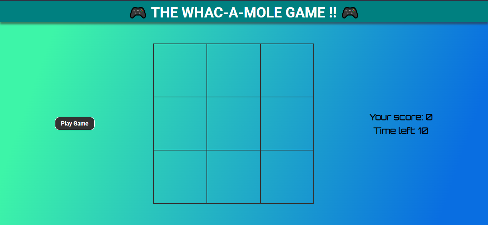
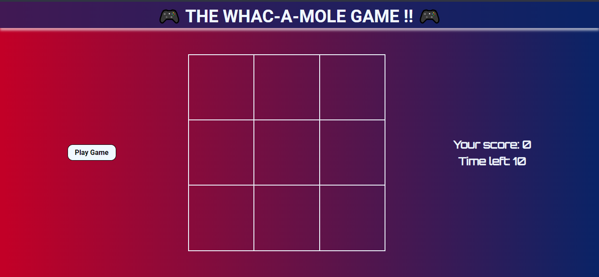

# FreeCodeCamp - whac-a-mole

This is my solution to the **whac-a-mole game** taught by [Ania Kubów](https://github.com/kubowania) on FreeCodeCamp.

## Table of contents

- [Overview](#overview)
  - [Screenshot](#screenshot)
  - [Links](#links)
- [My process](#my-process)
  - [Built with](#built-with)
- [Author](#author)
- [Acknowledgments](#acknowledgments)

## Overview

### Screenshot

#### Light Theme

#### Dark Theme

### Links

- Live Site URL: [wakamol](https://wakamol.netlify.app)

## My process

### Built with

- Semantic HTML5 markup
- CSS custom properties
- Flexbox
- CSS Grid
- Light + Dark Theme

## Author

- Twitter - [@Lamy237](https://www.twitter.com/Lamy237)

## Acknowledgments

- [FreeCodeCamp: Learn JavaScript by Building 7 Games](https://youtu.be/ec8vSKJuZTk)
- [GitHub: kubowania](https://github.com/kubowania/whac-a-mole)
